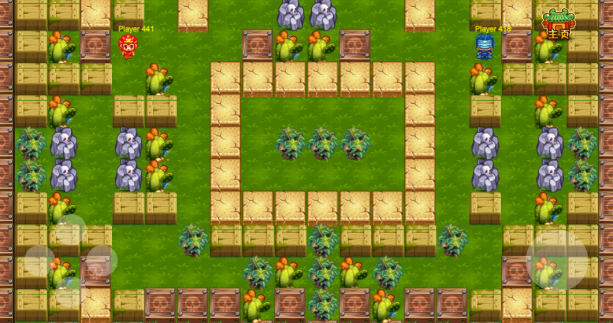

# 一个类似QQ堂的小游戏
* 绘图使用`pixi.js`，联机实现采用的是`socket.io`
* 目前支持两人联机对战
* pc端通过方向键+空格控制，手机端会加载罗盘

# Demo
## 因为目前只支持两人对战，所以只有等加入的房间满2人才会开始，可以自己开两个窗口
[Demo](http:47.240.9.34:3003/qqtang)


# Screenshots



# Docker部署
```
docker pull jinfeiyang/qqtang
docker run -d -p 3003:3003 --name qqtang jinfeiyang/qqtang
```

# 代码部署
需要部署服务端[qqtang-server](https://github.com/Gitjinfeiyang/qqtang-server)

# TODO
* 碰撞检测有偏差
* 首页启动图会变形，细节样式优化
* 支持自定义房间
